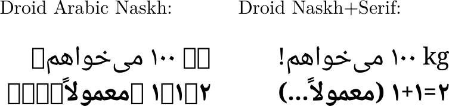

# Droid Naskh+Serif 

The Apache-licensed [Droid Arabic Naskh](https://github.com/jenskutilek/free-fonts/tree/master/Droid/Droid%20Arabic%20Naskh/TTF) font lacks basic punctuation, mathematical operators, Latin characters, et cetera. Droid Naskh+Serif extends Droid Arabic Naskh by merging it with Apache-licensed [Droid Serif](https://github.com/jenskutilek/free-fonts/tree/master/Droid/Droid%20Serif/TTF) for increased coverage, including Greek and Cyrillic. This was done using [FontForge](https://github.com/fontforge/fontforge). 

Droid Naskh+Serif is also licensed under the Apache License Version 2.0.

See also the [Sahl Naskh](https://github.com/khaledhosny/sahl-naskh) font which merges the same two fonts and applies some fixes to the Arabic set, but does not contain Greek or Cyrillic.
