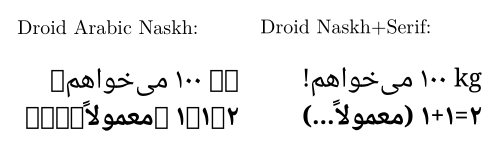

# Droid Naskh+Serif 

Droid Naskh+Serif is an Apache-Licensed TrueType font that merges [Sahl Naskh](https://github.com/khaledhosny/sahl-naskh) (itself a merger of a modified [Droid Arabic Naskh](https://github.com/jenskutilek/free-fonts/tree/master/Droid/Droid%20Arabic%20Naskh/TTF) with [Droid Serif](https://github.com/jenskutilek/free-fonts/tree/master/Droid/Droid%20Serif/TTF)) with an extended version of Droid Serif, and removes the alternative glyphs added by Sahl Naskh. The resulting font has extensive coverage of Arabic, Latin, Greek, and Cyrillic, and includes regular punctuation marks, mathematical operators, currency symbols, et cetera.

The original Droid Arabic Naskh font lacks basic punctuation, Latin characters, mathematical operators, et cetera. The Sahl Naskh font by Khaled Hosny therefore merged this font with Droid Serif, and additionally improved it by adjusting the placement of Arabic vowel diacritics and applying a number of other fixes. However, it also added a number of alternative Arabic glyphs that in my opinion reduced legibility, and used a limited version of Droid Serif. Droid Naskh+Serif removes these alternative glyphs while adding the extended range now offered by Droid Serif. This was done using [FontForge](https://github.com/fontforge/fontforge). 

Droid Arabic Naskh, Droid Serif, Sahl Naskh, and Droid Naskh+Serif are all licensed under the Apache License Version 2.0.
